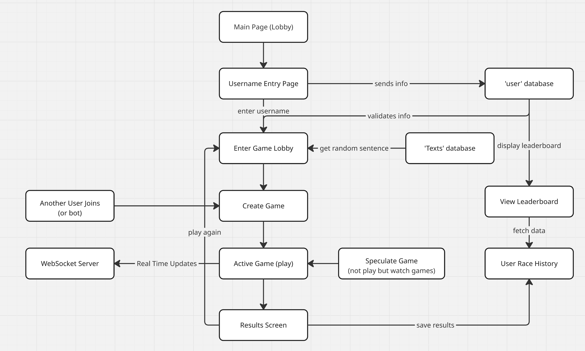
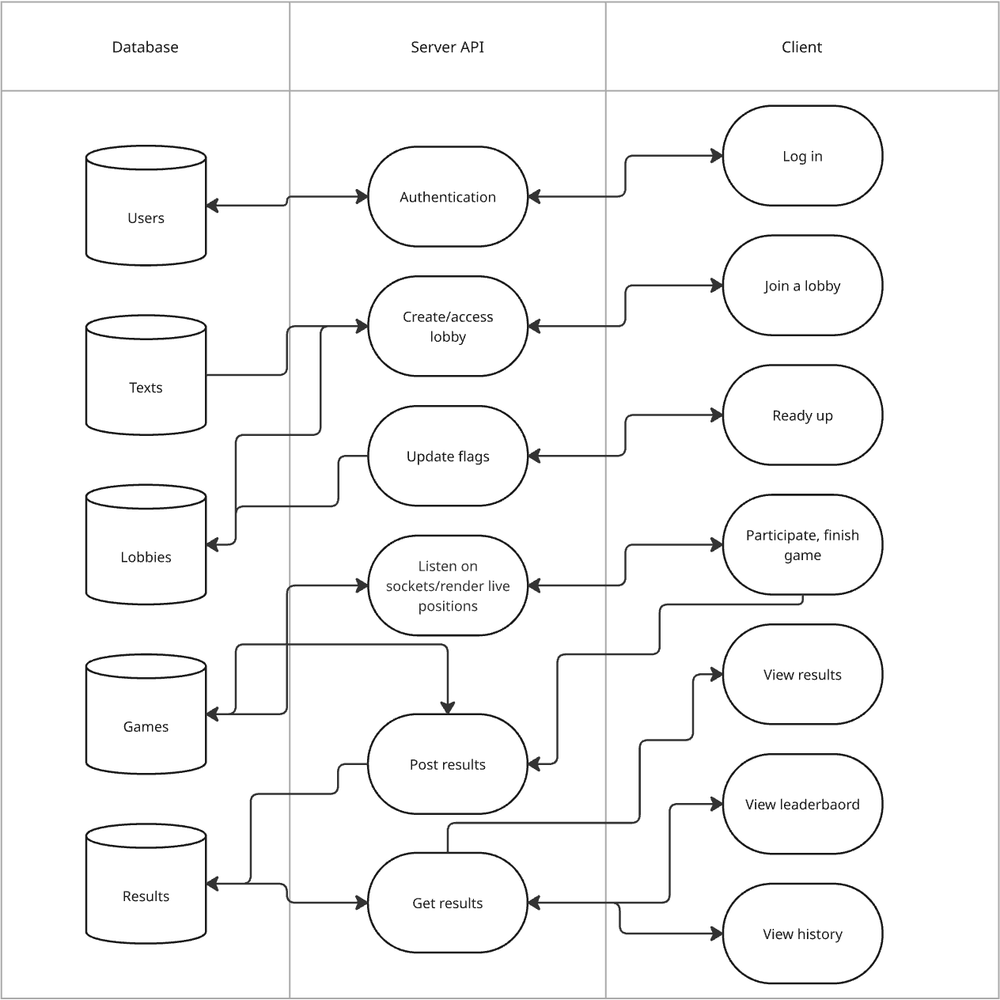

# TypeSprint
By: Jimin Sung, Yoobin Lee, Ryan Cho, Kaylee Cho

# Project Description

As developers, we wanted to have a project that combines everything we learned in this course but also something that we would enjoy using and interesting at the same time. Given these motivations, we decided to build a “typeracer” clone application which is designed for practicing typing and having fun simultaneously. 

## Who is our target audience?

Our target audience range can vary depending on users' intention to use our application. To be clear in designing our application, we defined three different target audience groups. First of all, anyone who is looking to improve their typing speed and accuracy in a fun way. Secondly, any casual gamers who enjoy light, but still competitive games that can be played quickly and learn something at the same time. Lastly, educators or tutors who may want to use typing games as an engaging education tool for their students.

## Why does our audience want to use our application?

We offer a unique combination of entertainment and utility. Our users are looking for a competitive yet enjoyable environment to improve a practical skill. When we think of characteristics of typeracer, instant performance feedback, such as words per minute, accuracy, and completion time, is valuable and one of the priorities on our application. This application is not only designed for solo players but also offers a live competition game system where users can challenge their friends to add another layer of engagement. Furthermore, personal record or global-wise scoreboard not only offers long-term motivation and a sense of achievement, but also offers replayability, which makes our app unique and considered a good game. 

## Why do we as developers want to build this application?

Given these motivations, we're excited to build this application because it's technically rewarding and practical to use. This project allows us to apply and integrate the technologies we've studied like Node.js and Express on the server, MongoDB for data storage, WebSockets for real-time communication, etc. It pushes us to tackle hard problems like synchronization of state, race logic, and responsiveness of the UI. Most importantly, it presents us with an opportunity to collaborate as a team in unison to build an end-to-end, full-stack application that features not only our technical acumen but also our creativity and combined enthusiasm for developing something which counts.

# Technical Description

## Architectural Diagrams

## Data Flow

## Summary Tables for User Stories

| Priority | User              | Description                                                                                             | Technical Implementation                                                                                                 |
| -------- | ----------------- | ------------------------------------------------------------------------------------------------------- | ------------------------------------------------------------------------------------------------------------------------ |
| P0       | New Player        | As a new user, I want to be able to join a game lobby and race the next person who joins the same lobby | RESI API with a POST /join endpoint + websockets to create a joinable game room                                          |
| P0       | Player            | As a player, I want to receive a random text to type when the game starts                               | Use a GET /text endpoint to retrieve a random text stored in MongoDB which is sent via WebSockets for all racers to type |
| P0       | Player            | As a player, I want to know who won the race                                                            | Use WebSockets to determine when all users finish the race and display the results while also saving them in MongoDB     |
| P0       | Player            | As a player, I want to be able to log in                                                                | Use Azure for login service and authenticating users                                                                     |
| P1       | Player            | As a player, I want to be able to see various stats at the end of the race(wpm, time, accuracy, etc.)   | Use WebSockets to determine race time of each user and calculate speed using the text length and racing time             |
| P1       | New Player        | As a new player, I want to be able to have a profile with personalized information(username, etc.)      | Use Express sessions and Azure authentication to sign in and store user information like game history in MongoDB         |
| P1       | Player            | As a player, I want to see the real-time progress of other users during the race                        | Provide visual updates via WebSockets                                                                                    |
| P1       | Player            | As a player, I want to see a leaderboard of the fastest times                                           | Store a list of the fastest racers in MongoDB and use a GET /leaderboard endpoint to fetch it                            |
| P1       | Returning Player  | As a returning player, I want to be able to see my racing history                                       | Use Express sessions and Azure authentication to sign in and store user information like game history in MongoDB         |
| P2       | Spectating Player | As a spectating player, I want to watch live races without participating                                | WMake matches a spectacle in real time using WebSockets                                                                  |
| P2       | Returning Player  | As a returning player, I want to be able to choose who I race against                                   | Use WebSockets to handle incoming connections and create UI to allow users to pick from available online users           |

## API Endpoints:

### Auth
- POST /api/auth/login - Log in (via Azure), establish session
- POST /api/auth/logout- Log out and destroy session	
- GET	/api/auth/me - Get current user’s profile

### Text
- GET	/api/text/random - Return one random text for typing practice
- GET	/api/text - List all texts in DB for user to choose from

### Matchmaking
- POST /api/lobbies/join - Join an open lobby or create one; returns lobbyId
- GET /api/lobbies/:lobbyId	- View lobby status (players joined, isReady flag)

### In Game
- POST /api/games/:lobbyId/start - Start the race for all players in the lobby
- GET	/api/games/:gameId - Get game metadata (text, players, start time)
- POST /api/games/:gameId/finish - Submit finish time, accuracy, wpm, etc for the current user
- GET	/api/games/:gameId/results - Get final standings and stats for this game

### User Profile
- GET	/api/users/:userId/history - Get this user's game history (wpm, accuracy, date, etc)

### Leaderboard
- GET	/api/leaderboard - Top N all-time fastest races
- GET	/api/stats/:userId/summary - Stats for user (avg WPM, total races, avg accuracy, etc)

## Database Schemas:

### User
- username (String)
- userId (String)

### Text
- text (String)

### Lobby
- players ([ref User])
- isReady (Boolean)
- created (Date)

### Game
- lobby (ref Lobby)
- text (ref Text)
- start (Date)
- end (Date)
- results (ref Result)
  
### Result
- user (ref User)
- finishTime (Date)
- wpm (Number)
- accuracy (Number)
